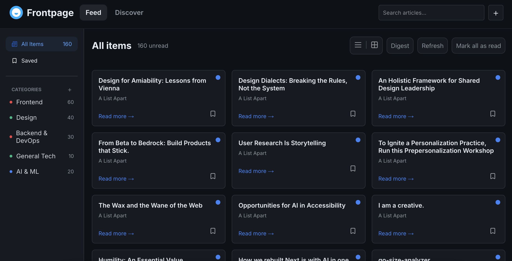

# Frontpage — Sophia

A customizable content aggregator that pulls RSS and Atom feeds into one well-designed reading dashboard.

**Live URL:** [https://frontpage-weld.vercel.app/]

---

## Overview
Frontpage is an website for you to organize and view the latest articles of your favorite feeds. You can also discover new feeds.

### Tech Stack

| Layer | Technology |
|-------|-----------|
| Framework | Next.js 15 |
| Database | Neon |
| Authentication | JWT |
| Hosting | Vercel |
| Styling | CSS |
| Other | Zustand and Tansquery |

---

### Problem solving

**The problem I was solving:**
The duality between the guest state and user state. It made me confused on how to make both guest and logged users to experience the same while using the website.

**My approach:**
I decided to use zustand so i can have an global state and use less useEffect.

**Why I chose this approach:**
I chose it because this way i can save things locally more easily and dont need to keep worrying about putting many components one inside the other or worry about the order of my folders and components.

**What I'd do differently:**
I'm not sure what i would do differently since this looked like the only and easiest solution, but im open for sugestions.

### Design Choices

I chose to follow the preview image given by frontendmentor very closely. I liked the style.

---

## Development Journey

### What Surprised Me

At first i thought it would be easy to control both guest state and user state. Although things werent easy i liked this challenge.

### Session Breakdown

| Session | Focus | What I Accomplished |
|---------|-------|-------------------|
| 1 | Landing Page | A visually interesting landing page |
| 2 | Header and Sidebar | Both header and sidebar are 100% interactive |
| 3 | Feed and Discover | Two options of grid and digest option for feed |

---

## AI Collaboration Reflection

### How I Used AI

I did most of the project by myself but towards the end where i needed to show the articles i chose to ask the copilot of github for help, i also corrected mistakes i made with AI.

### What Worked Well

At the start of this project AI wasnt helping very much, but towards the end it was very helpful. Explaining my ideas in a detailed way helped a lot.

### What I Learned

I started to learn that the more i explain to the AI and the more instructions i give, the better.

---

## Known Limitations

Can't delete categories or edit categories from feeds. I plan on adding ways to edit categories and delete.

---

## Acknowledgments

Built as a [Frontend Mentor Product Challenge](https://www.frontendmentor.io).
